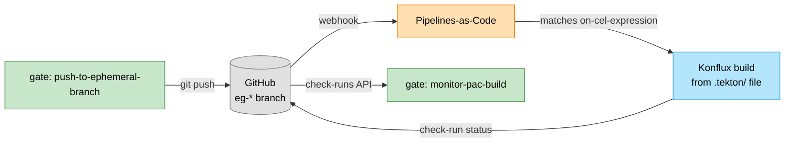

# Early Gate Build Pipeline — Design Document

The Early Gate answers one question before anything merges: **do this set of unmerged PRs
actually compose into a working catalog?**

It takes a group of open PRs, builds the operator from them, builds a bundle around that
operator, builds an FBC fragment around that bundle, and reports the result on the PR that
started it.

| | |
|---|---|
| **Tekton name** | `early-gate-component-pipeline` |
| **Source** | [`early-gate/early-gate-component-pipeline.yaml`](../early-gate-component-pipeline.yaml) |
| **Triggered by** | Explicit launch against a leader PR (see [§12](#12-user-guide)) |
| **Repositories touched** | `rhods-operator`, `RHOAI-Build-Config` |
| **Images produced** | 3, all into `quay.io/rhoai/pull-request-pipelines` |

Companion documents: [`pipeline-overview.md`](pipeline-overview.md) for a narrative walkthrough,
[`block2-bundle-design.md`](block2-bundle-design.md) for Block 2's design rationale.

---

## 1. Purpose

The pipeline sequentially produces three OLM artifacts in a single run:

| Artifact | Built from | Description |
|---|---|---|
| **Operator** | `rhods-operator` @ ephemeral branch | The RHOAI operator container, with every component digest pinned from the PR group |
| **Bundle** | `RHOAI-Build-Config` @ ephemeral branch | OLM bundle whose CSV references the operator above, by digest |
| **FBC fragment** | `RHOAI-Build-Config` @ ephemeral branch | OLM catalog fragment carrying the bundle above, by digest |

### The one distinction to understand first

**This pipeline does not build anything itself.** There is no `buildah` task in it, no
`prefetch-dependencies`, no `build-image-index`.

Instead, each block **pushes a commit to an ephemeral branch** and lets Pipelines-as-Code
start the real Konflux build from the `.tekton/` file already living in that repository. The
gate then follows that build over the GitHub **check-runs API**.

Three consequences, and they are the whole design:

1. **The gate builds exactly what release builds.** Same pipeline, same scanners, same
   platforms, same hermetic settings — because it is literally the same `.tekton` definition
   family, not a reimplementation that drifts.
2. **The gate needs no Konflux cluster access.** It reads check-runs on GitHub. It does not
   care which tenant or cluster the build landed in.
3. **A branch is mandatory.** PaC's only trigger is "a commit appeared". No branch, no build.
   This is the first of three reasons the ephemeral branches exist — see [§3](#3-why-ephemeral-branches).

> If you have read the ODH `early-gate-build-pipeline-design.md`, this is the single largest
> divergence between the two. A side-by-side comparison is in [§13](#13-differences-from-the-odh-early-gate-pipeline).

---

## 2. Workflow Diagram

```mermaid
flowchart TD
    A[init]:::init --> B[resolve-group-configuration]:::snapshot
    B --> C[generate-snapshot]:::snapshot
    C --> D[audit-snapshot]:::snapshot

    D --> E[fork-operator-branch<br/>eg-PR-UID]:::branch
    E --> F[trigger-operator-processor-<br/>on-ephemeral-branch]:::build
    F --> G[monitor-operator-processor]:::build
    G --> H[monitor-operator-build]:::build

    H --> I[clone-build-config]:::bundle
    I --> J[fork-bundle-branch<br/>eg-bundle-UID]:::branch
    J --> K[update-group-snapshot]:::bundle
    K --> L[bundle-processor]:::bundle
    L --> M[verify-bundle-images]:::verify
    M --> N[push-bundle-to-ephemeral-branch]:::bundle
    N --> O[monitor-bundle-build]:::bundle

    O --> P[fork-fbc-branch<br/>eg-fbc-UID]:::branch
    P --> Q[fbc-processor]:::fbc
    Q --> R[verify-fbc-images]:::verify
    R --> S[push-fbc-to-ephemeral-branch]:::fbc
    S --> T[monitor-fbc-build]:::fbc

    T --> U([FBC_IMAGE_REF_BY_DIGEST]):::terminal

    classDef init fill:#bbdefb,stroke:#1976d2,color:#000
    classDef snapshot fill:#e1bee7,stroke:#7b1fa2,color:#000
    classDef branch fill:#ffe0b2,stroke:#f57c00,color:#000
    classDef build fill:#c8e6c9,stroke:#388e3c,color:#000
    classDef bundle fill:#b3e5fc,stroke:#0288d1,color:#000
    classDef fbc fill:#b2dfdb,stroke:#00796b,color:#000
    classDef verify fill:#ffcdd2,stroke:#c62828,color:#000
    classDef terminal fill:#e0e0e0,stroke:#757575,color:#000
```



Plus a `finally` block that always runs — verdict comment and branch cleanup. See
[§4.5](#phase-4-finally-always-runs).

### Where the real builds happen

The three `monitor-*-build` tasks are not builds. They are waiters. The actual build runs
outside this pipeline:



---

## 3. Why Ephemeral Branches

Every write the gate makes goes to a throwaway `eg-*` branch. There are three independent
reasons, and all three matter.

### Reason 1 — it is the only way to trigger a real build

Covered in [§1](#the-one-distinction-to-understand-first). PaC triggers on a push. No branch,
no build, no gate.

### Reason 2 — safety: nothing may touch a release branch

An early-gate run must **never** write to `rhoai-X.Y`. This is enforced at four separate
points, not by convention:

| Enforcement point | What it refuses |
|---|---|
| `create-ephemeral-branch` | Refuses to create any branch not named `eg-*` |
| `operator-processor.yaml` (EG mode) | Hard-fails if `eg-branch` is not `eg-*` |
| `bundle-processor` / `fbc-processor` | Hard-fail if `BRANCH` is not `eg-*` |
| push tasks | Refuse any commit message not starting with `early-gate:` |

> `create-ephemeral-branch` carries the comment *"the name is the one thing a caller can get
> wrong"* — the guard is there precisely because a mistyped parameter is the realistic failure
> mode, not a malicious one.

### Reason 3 — why *three* branches, not one

The operator branch has to live in `rhods-operator` — a different repository. But the bundle
and FBC branches are **both** in `RHOAI-Build-Config`, and they are deliberately kept on
disjoint prefixes:

> Block 3 could have reused Block 2's branch. But the bundle's CEL fires on `eg-bundle-*` with
> an `early-gate:` subject — which is precisely the shape of Block 3's catalog push. Sharing a
> branch would mean every FBC push also rebuilt the bundle.

### Branch naming

| Block | Branch | Forked from |
|---|---|---|
| 1 — Operator | `eg-<leader-pr-number>-<pipelineRun.uid>` | `main` or `stable`, decided by `resolve-group-configuration` |
| 2 — Bundle | `eg-bundle-<pipelineRun.uid>` | latest `rhoai-X.Y` on `RHOAI-Build-Config` |
| 3 — FBC | `eg-fbc-<pipelineRun.uid>` | latest `rhoai-X.Y` on `RHOAI-Build-Config` |

All three are deleted by `finally`, unless a `defer-*-cleanup` parameter says otherwise.

---

## 4. Execution Phases

### Phase 0: Group resolution and snapshot

| Task | Purpose |
|---|---|
| `init` | Standard Konflux `init` (task-init:0.2). Kept for parity with upstream; **its `build` result is not consumed here**. There is deliberately no `rhoai-init` — this pipeline builds nothing, and `rhoai-init` 0.3 mounts a `slack-config` ConfigMap that `rhoai-tenant` lacks. |
| `resolve-group-configuration` | Reads the leader PR once and expands it into the component group. Decides which branch Block 1 forks from. Details below. |
| `generate-snapshot` | Resolves every component in the group to a concrete image digest and writes `snapshot.json` into an OCI trusted artifact. Details below. |
| `audit-snapshot` | **Logging and metadata only.** Details below — it is not what its name suggests. |

#### `resolve-group-configuration`

Reads the leader PR body via the GitHub API and:

- **Decides the fork source.** If the operator repo is itself in the group, fork from
  `operator-source-branch` (`main`) — that is where the operator PR will land. Otherwise fork
  from `fallback-source-branch` (`stable`).
- **Finds the child PR section.** Looks for a heading matching `child.*prs`, then extracts
  every `https://github.com/<org>/<repo>/pull/<n>` URL until the next `##`.
- **Validates orgs.** Each child PR's org must appear in `allowed-child-orgs`
  (`red-hat-data-services`). The membership test is one org per line and an exact whole-string
  match, not a substring test.
- **Maps repos to components** through `component_repo_map.json`.
- **Captures each child PR's head SHA.** This is load-bearing: the shared PR-pipelines
  repository tags by commit, and a PR number cannot locate an image there.
- **Degrades rather than fails.** An unreadable child PR produces a warning, not a dead
  pipeline. Likewise an unparseable body falls back to the leader repo's components alone.

#### `generate-snapshot`

For each component, probes in order:

1. `quay.io/rhoai/pull-request-pipelines:<component>-<head-sha>` — the PR build RHOAI already
   publishes.
2. The release tag — `rhoai-<major>.<minor>`, derived from `rhoai-version`, or
   `fallback-tag` if given explicitly.

Each component is recorded as `pr` or `fallback`, and the task emits a TSV component table
plus a `fallback-warning` result. **This is where "which components were actually tested"
is recorded** — the table ends up in the leader-PR comment.

> A component marked `fallback` is not being tested. It is the released image. The table is
> how you tell how much of a gate run is real.

The resolution strategy and the measurements behind it are written up in
[`../PR-DIGESTS.md`](../PR-DIGESTS.md).

#### `audit-snapshot` — read this before relying on it

Despite the name, **it validates nothing.** There is no assertion and no failure path. It is
an inline `taskSpec`, not a file under `tasks/`. It does two things:

1. **Prints a per-component dump** — image, `git.commit`, `git.url` for every component — so
   that a bad gate result has one place to look.
2. **Harvests PaC metadata into results**: `pull-request-author`, `pull-request-number`,
   `git-repo`, `git-org`, `git-revision` from the PipelineRun's own annotations, plus a
   computed `snapshot-contains-operator` boolean.

Two caveats:

- **All six results are currently unconsumed.** Nothing in the pipeline reads
  `audit-snapshot.results.*`. Downstream, `fork-operator-branch` only uses it as a `runAfter`
  barrier.
- The `fieldRef` lookups only populate on a PaC-created PipelineRun. The gate is launched
  explicitly, so in practice those five results are empty strings.

`snapshot-contains-operator` exists because the ODH pipeline branches on it — see
[§13](#13-differences-from-the-odh-early-gate-pipeline). Here it is computed and discarded.

---

### Phase 1: Operator

| Task | Purpose |
|---|---|
| `fork-operator-branch` | Creates `eg-<pr>-<uid>` via the GitHub refs API. Refuses any non-`eg-*` name. |
| `trigger-operator-processor-on-ephemeral-branch` | Dispatches the `operator-processor` GitHub Actions workflow with `eg-mode: true` and `eg-branch`. |
| `monitor-operator-processor` | Waits for the workflow and returns the commit it pushed (`processor-commit`). |
| `monitor-operator-build` | Waits for the PaC build on that commit; returns the image by digest. |

**What `operator-processor` does in EG mode:** refuses a non-`eg-*` branch; reads its
configuration from the *release* branch of `RHOAI-Build-Config` but checks out and pushes to
the *ephemeral* operator branch; pins every component digest from the snapshot into
`build/operands-map.yaml`; commits with `--allow-empty` and a subject starting `early-gate:`.

`--allow-empty` matters. When the group's components already carry the current digests, the
processor writes nothing — and without a commit, no push happens, so no build is triggered,
and the gate waits for something that will never arrive.

**Out:** `OPERATOR_IMAGE_REF_BY_DIGEST`.

---

### Phase 2: Bundle

| Task | Purpose |
|---|---|
| `clone-build-config` | Resolves the latest Y-stream `rhoai-X.Y` branch on `RHOAI-Build-Config` and clones it into a trusted artifact. |
| `fork-bundle-branch` | Creates `eg-bundle-<uid>`. |
| `update-group-snapshot` | Injects Block 1's operator digest into the bundle inputs (DR-2). **Refuses a reference that is not digest-pinned.** |
| `bundle-processor` | Runs RHOAI's `bundle-processor.py -op bundle-patch`, regenerating the CSV, `annotations.yaml` and the build-args map with every image pinned by digest. |
| `verify-bundle-images` | Independent oracle: asserts the processed bundle references early-gate images and not release ones (DR-6). |
| `push-bundle-to-ephemeral-branch` | Commits `bundle/` with an `early-gate:` subject — this is what triggers the PaC bundle build (DR-1c, DR-1d). |
| `monitor-bundle-build` | Waits for that build; returns the bundle by digest. |

Notable details inside `bundle-processor`:

- Refuses a release-shaped `QUAY_TAG` up front — `rhoai-*`, `odh-stable`, `latest`, `stable`,
  `*-nightly` all hard-fail (DR-3d). The globs are whole-string, so `latest` is rejected but
  `my-latest-build` is not.
- `--use-existing-digests`, so the operator digest comes from `bundle-patch.yaml` rather than
  a Quay tag lookup.
- `-y` is pointed at a **scratch copy** of the push pipeline. The real `.tekton` file is never
  modified; the processor would otherwise rewrite it in place.
- SBOM extraction (`-mc`) is attempted only when `metadata-config.yaml` exists *and* `cosign`
  and `skopeo` are present *and* `registry.redhat.io` credentials resolved. Otherwise it warns
  and continues.

**Out:** `BUNDLE_IMAGE_REF_BY_DIGEST`.

---

### Phase 3: FBC fragment

| Task | Purpose |
|---|---|
| `fork-fbc-branch` | Creates `eg-fbc-<uid>`. |
| `fbc-processor` | Points the semver template at Block 2's bundle, renders with `opm`, regenerates `catalog/<version>/rhods-operator/catalog.yaml`. |
| `verify-fbc-images` | Independent oracle (DR-F6). Details below. |
| `push-fbc-to-ephemeral-branch` | Commits `catalog/`. |
| `monitor-fbc-build` | Waits for the FBC build. |

`fbc-processor` in sequence:

1. Validates `BUNDLE_IMAGE_DIGEST` is literally `sha256:` + 64 hex, and that `BRANCH` is
   `eg-*`.
2. Runs `fbc-processor.py -op extract-snapshot-images` — **tolerated, not required**. It
   expects a cosign `.sig` tag beside the image under `quay.io/rhoai`, and an early-gate image
   is neither there nor signed. A failure here is logged and the run continues.
3. Sets `.stable.bundles[0].image` in the semver template to Block 2's by-digest reference.
4. Renders twice with `opm alpha render-template semver` — bundle-object and csv-metadata
   formats — and picks csv-metadata for OCP 4.20 and above.
5. Runs `fbc-processor.py -op catalog-patch` with `--purge-bundles <name>`.
6. Greps the output catalog for the bundle digest and fails if it is absent.

#### Why `verify-fbc-images` exists

This is the sharpest failure mode in the whole design, and the reason the verify tasks are
*independent oracles* rather than re-runs of the production code path:

> `patch_olm_bundles` only inserts when the bundle name is not already present in the catalog.
> If it is present, it **writes nothing at all** — and leaves behind a perfectly valid,
> completely unmodified *release* catalog. Without an independent check, the gate would build
> that catalog and pass.

So `verify-fbc-images` re-derives the answer from the committed artifact and checks that the
new `olm.bundle` exists, points at Block 2's exact digest, carries Block 1's digest, is
reachable from a channel, and references no release-tagged images.

`--purge-bundles` is what is *supposed* to prevent the silent no-op; the verify task is what
catches it when it does not.

**Out:** `FBC_IMAGE_REF_BY_DIGEST` — the gate's final answer.

---

### Phase 4: `finally` — always runs

| Task | Purpose |
|---|---|
| `comment-on-leader-pr` | Posts the verdict for all three blocks on the leader PR, including the component table. |
| `comment-on-leader-pr-failure` | Failure-path variant. |
| `cleanup-ephemeral-branch` | Deletes `eg-<pr>-<uid>` (DR-1e), or deliberately leaves it (DR-1f). |
| `cleanup-bundle-ephemeral-branch` | Deletes `eg-bundle-<uid>`. |
| `cleanup-fbc-ephemeral-branch` | Deletes `eg-fbc-<uid>`. |

The branches go away even when the run fails. Each cleanup has a `defer-*-cleanup` switch for
when you want to inspect a generated artifact after the fact.

---

## 5. The Digest Handoff Chain

Every hand-off between blocks is by **digest** — `repo@sha256:…` — never by tag.

A tag is mutable: rebuild the same commit and it moves. A gate that chained on tags could pass
on one image and ship another.

| Produced by | Result | Consumed by |
|---|---|---|
| `monitor-operator-build` | `OPERATOR_IMAGE_REF_BY_DIGEST` | `update-group-snapshot` → the bundle CSV |
| `monitor-bundle-build` | `BUNDLE_IMAGE_REF_BY_DIGEST` | `fbc-processor` → the catalog's `olm.bundle` |
| `monitor-fbc-build` | `FBC_IMAGE_REF_BY_DIGEST` | the gate's verdict |

This is enforced, not merely documented:

- `update-group-snapshot` **refuses** a Block 1 reference that is not digest-pinned.
- `fbc-processor` **refuses** a `BUNDLE_IMAGE_DIGEST` that is not `sha256:<64 hex>`, with an
  explicit note that `monitor-bundle-build` warns rather than fails when it cannot read a tag
  back — so an empty digest means the handoff silently did not happen.
- Each block's verify task independently re-checks that the previous block's digest actually
  arrived in the artifact.

---

## 6. Artifact Flow

All inter-task data passes through **OCI Trusted Artifacts**.

```mermaid
flowchart LR
    subgraph Block0[Block 0]
        RGC[resolve-group-configuration]:::snapshot -->|group-components| GS[generate-snapshot]:::snapshot
        GS -->|SNAPSHOT_ARTIFACT| AS[audit-snapshot]:::snapshot
    end

    subgraph Block1[Block 1 — Operator]
        GS -->|SNAPSHOT_ARTIFACT| OP[operator-processor<br/>via GitHub Actions]:::build
        OP -->|commit| MOB[monitor-operator-build]:::build
    end

    subgraph Block2[Block 2 — Bundle]
        CBC[clone-build-config]:::bundle -->|SOURCE_ARTIFACT| UGS[update-group-snapshot]:::bundle
        MOB -->|OPERATOR_IMAGE_REF_BY_DIGEST| UGS
        UGS -->|SOURCE_ARTIFACT| BP[bundle-processor]:::bundle
        BP -->|SOURCE_ARTIFACT| VB[verify-bundle-images]:::verify
        VB -->|SOURCE_ARTIFACT| PB[push-bundle-to-ephemeral-branch]:::bundle
        PB -->|commit| MBB[monitor-bundle-build]:::bundle
    end

    subgraph Block3[Block 3 — FBC]
        MBB -->|BUNDLE_IMAGE_REF_BY_DIGEST| FP[fbc-processor]:::fbc
        CBC -->|SOURCE_ARTIFACT| FP
        FP -->|SOURCE_ARTIFACT| VF[verify-fbc-images]:::verify
        VF -->|SOURCE_ARTIFACT| PF[push-fbc-to-ephemeral-branch]:::fbc
        PF -->|commit| MFB[monitor-fbc-build]:::fbc
    end

    classDef snapshot fill:#e1bee7,stroke:#7b1fa2,color:#000
    classDef build fill:#c8e6c9,stroke:#388e3c,color:#000
    classDef bundle fill:#b3e5fc,stroke:#0288d1,color:#000
    classDef fbc fill:#b2dfdb,stroke:#00796b,color:#000
    classDef verify fill:#ffcdd2,stroke:#c62828,color:#000
```



Throwaway OCI artifacts expire after `image-expires-after` (default `7d`); intermediate
processor artifacts after `1h`.

---

## 7. Pipeline Results

### Block 0 / Block 1

| Result | Description |
|---|---|
| `SNAPSHOT_ARTIFACT` | OCI artifact containing `snapshot.json` |
| `OMITTED_COMPONENTS` | Components that could not be resolved into the group |
| `EG_BRANCH` | The ephemeral operator branch |
| `OPERATOR_COMMIT` | Commit `operator-processor` pushed |
| `OPERATOR_IMAGE_URL` | Operator image URL |
| `OPERATOR_IMAGE_DIGEST` | Operator image SHA256 digest |
| `OPERATOR_IMAGE_REF_BY_DIGEST` | Full `repo@sha256:…` reference |
| `BUILD_STATUS` | Operator build outcome |

### Block 2

| Result | Description |
|---|---|
| `EG_BUNDLE_BRANCH` | The ephemeral bundle branch |
| `BUNDLE_RELEASE_BRANCH` | The `rhoai-X.Y` branch Block 2 resolved and forked from |
| `BUNDLE_COMMIT` | Commit pushed to the ephemeral bundle branch |
| `BUNDLE_IMAGE_URL` / `BUNDLE_IMAGE_DIGEST` / `BUNDLE_IMAGE_REF_BY_DIGEST` | Bundle image |
| `BUNDLE_BUILD_STATUS` / `BUNDLE_BUILD_URL` | Build outcome and link |
| `BUNDLE_VERIFIED` | `"true"` when every image in the bundle passed the DR-6 checks |

### Block 3

| Result | Description |
|---|---|
| `EG_FBC_BRANCH` | The ephemeral FBC branch |
| `FBC_CATALOG_PATH` | Repo-relative path of the catalog that was regenerated |
| `FBC_BUNDLE_NAME` | `olm.bundle` name the regenerated catalog carries |
| `FBC_COMMIT` | Commit pushed to the ephemeral FBC branch |
| `FBC_IMAGE_URL` / `FBC_IMAGE_DIGEST` / `FBC_IMAGE_REF_BY_DIGEST` | FBC fragment image |
| `FBC_BUILD_STATUS` / `FBC_BUILD_URL` | Build outcome and link |
| `FBC_VERIFIED` | `"true"` when the regenerated catalog passed the DR-F6 checks |

---

## 8. Parameters Reference

### Leader PR and group

| Parameter | Default | Description |
|---|---|---|
| `leader-pr-repo` | *(required)* | `org/repo` of the promoter repository holding the leader PR |
| `leader-pr-number` | *(required)* | Leader PR number |
| `allowed-child-orgs` | `red-hat-data-services` | GitHub orgs a child PR may come from |
| `rhoai-version` | `""` | Which RHOAI release this run is for, as `3.5` or `rhoai-3.5` |
| `fallback-tag` | `""` | Quay tag `generate-snapshot` uses for a component with no PR build |
| `triggering-branch` | `""` | The branch this run was triggered on |

### Operator (Block 1)

| Parameter | Default | Description |
|---|---|---|
| `operator-repo` | `red-hat-data-services/rhods-operator` | Operator repository to fork and build |
| `operator-output-image` | `quay.io/rhoai/pull-request-pipelines` | Image repository, without a tag |
| `operator-source-branch` | `main` | Fork source when the group includes the operator repo |
| `fallback-source-branch` | `stable` | Fork source when the leader PR cannot be read |
| `build-check-name` | `odh-operator-eg-on-push` | Name of the PaC check-run to watch |
| `snapshot-operator-key` | `odh-operator-ci` | Key the operator is recorded under in `config/snapshot.json` |
| `processor-timeout-minutes` | `30` | Budget for `operator-processor`, including Actions queueing |
| `build-timeout-minutes` | `270` | Budget for the operator build; must outlast the 4h ceiling its own push pipeline gives itself |

### Build-Config (Blocks 2 and 3)

| Parameter | Default | Description |
|---|---|---|
| `build-config-repo` | `red-hat-data-services/RHOAI-Build-Config` | Repository holding bundle and catalog sources |
| `build-config-repo-url` | `https://github.com/red-hat-data-services/RHOAI-Build-Config.git` | Clone URL |
| `build-config-branch-override` | `""` | Pin the release branch instead of discovering the latest `rhoai-X.Y` |

### Bundle (Block 2)

| Parameter | Default | Description |
|---|---|---|
| `bundle-output-image` | `quay.io/rhoai/pull-request-pipelines` | Deliberately **not** the release repository `odh-operator-bundle` |
| `bundle-build-check-name` | `odh-operator-bundle-eg-on-push` | PaC check-run to watch |
| `bundle-verify-strict` | `false` | Passed to `verify-bundle-images` |
| `bundle-build-timeout-minutes` | `90` | Shorter than the operator's — `FROM scratch`, no compile, no multi-arch fan-out |
| `defer-bundle-branch-cleanup` | `false` | Leave the ephemeral branch in place |

### FBC (Block 3)

| Parameter | Default | Description |
|---|---|---|
| `fbc-output-image` | `quay.io/rhoai/pull-request-pipelines` | Deliberately **not** the release repository `rhoai-fbc-fragment` |
| `fbc-build-check-name` | `rhoai-fbc-fragment-eg-on-push` | PaC check-run to watch |
| `fbc-openshift-version` | `v4.19` | Which `catalog/<version>/` directory is regenerated (DR-F4) — one version, not all four |
| `fbc-push-pipeline-component` | `rhoai-fbc-fragment-eg` | Basename of the `.tekton/` file passed as `--push-pipeline-yaml-path` |
| `fbc-build-timeout-minutes` | `150` | Longer than the bundle's — a ~1GB base image and an `opm` render, once per architecture |
| `defer-fbc-branch-cleanup` | `false` | Leave the ephemeral branch in place, for inspecting a generated catalog |

### Infrastructure

| Parameter | Default | Description |
|---|---|---|
| `konflux-central-revision` | `main` | Revision this pipeline's task definitions resolve from |
| `image-expires-after` | `7d` | Expiry for throwaway OCI artifacts |

### Workspaces

| Workspace | Purpose |
|---|---|
| `github-credentials` | Secret workspace with a `token` key. Branch operations and the workflow dispatch — the latter needs `actions:write`, which the PaC token does not carry. |
| `quay-credentials` | `dockerconfigjson` for the RHOAI Quay read-only robot, used by `generate-snapshot` to resolve digests and git labels. |

---

## 9. Trigger Mechanism (Pipelines-as-Code)

Each block's build is started by a `.tekton` PipelineRun in the target repository:

| Block | PaC file | Fires on |
|---|---|---|
| 1 | `rhods-operator/.tekton/rhods-operator-eg-push.yaml` | push to `eg-*` |
| 2 | `RHOAI-Build-Config/.tekton/odh-operator-bundle-eg-push.yaml` | push to `eg-bundle-*` |
| 3 | `RHOAI-Build-Config/.tekton/rhoai-fbc-fragment-eg-push.yaml` | push to `eg-fbc-*` |

Block 1's CEL, as the representative case:

```
event == "push"
&& target_branch.startsWith("eg-")
&& ("build/operands-map.yaml".pathChanged()
    || event_title.startsWith("early-gate:"))
```

Two pushes land on an ephemeral branch — the one that **creates** it, and the one the
processor makes. Only the second is worth building:

- `pathChanged()` covers the ordinary case. Pinning the digests rewrites
  `build/operands-map.yaml`, and a branch-creation push reports no changed files.
- `event_title` covers the no-op case. With nothing to write the processor commits
  `--allow-empty`, touching no path, leaving the message as the only thing to match on.
- A branch-creation push carries main/stable's tip message, which never starts with
  `early-gate:`.

The `early-gate:` prefix is written in `.github/workflows/operator-processor.yaml`. **The two
have to change together.**

Note also what is **absent** from the EG files: no `build-nudge-files`. An early-gate build is
a throwaway validation of an ephemeral branch and must never open nudge PRs anywhere.

### Two things to know when reading a red run

- **A CEL parse error is not scoped to the clause that caused it.** The whole annotation
  becomes unevaluable, every arm dies, and PaC skips the PipelineRun **without registering a
  check-run** — which from the gate looks exactly like a build that never started. Regex
  escapes inside CEL string literals need `\\.`, not `\.`.
- **The git resolver resolves each `taskRef` when that task starts**, not when the pipeline
  starts, so a merge to `konflux-central` main can land mid-run.

---

## 10. Safety Rails

Nothing the gate does may disturb release runs or release digests.

| Rail | Mechanism |
|---|---|
| Never write to a release branch | `eg-*` name checked at four independent points — see [§3](#reason-2--safety-nothing-may-touch-a-release-branch) |
| Never push to a release image repository | All three blocks output to `quay.io/rhoai/pull-request-pipelines`, never `odh-rhel9-operator`, `odh-operator-bundle` or `rhoai-fbc-fragment` |
| Never collide with a release tag | Every tag carries an `eg-` segment, which cannot match `rhoai-X.Y`, `rhoai-X.Y-<sha>`, `rhoai-X.Y-nightly`, `odh-stable` or `odh-pr` |
| Never consume a release-tagged image | `bundle-processor` (DR-3d) and `fbc-processor` (DR-F2d) hard-fail on `rhoai-*`, `odh-stable`, `latest`, `stable`, `*-nightly` |
| Never produce an artifact referencing release images | `verify-bundle-images` (DR-6) and `verify-fbc-images` (DR-F6) fail the run and list the offending images |
| Never trigger a release workflow | No `build-nudge-files` on any EG `.tekton` file |
| Never leak a credential | See below |

### Credential handling

Credentials are consumed **only** as Kubernetes secret workspaces or `secretKeyRef`. Never
echoed, never on a command line, never in a remote URL.

Registry auth is written to a file by a stdlib-only Python helper under `umask 077`, rather
than `skopeo login -p` or `cosign login -p`, so no secret ever reaches the process list or a
`set -x` trace. The helper prints registry names only — never the usernames, never the
secrets.

---

## 11. Image Tagging Strategy

All three images go to `quay.io/rhoai/pull-request-pipelines`.

| Block | Tag format | Example |
|---|---|---|
| Operator | `odh-operator-<branch>-<commit>` | `odh-operator-eg-1234-a1b2c3-d4e5f6` |
| Bundle | `odh-operator-bundle-<branch>-<commit>` | `odh-operator-bundle-eg-bundle-a1b2c3-d4e5f6` |
| FBC | `rhoai-fbc-fragment-<branch>-<commit>` | `rhoai-fbc-fragment-eg-fbc-a1b2c3-d4e5f6` |

Each `image-tag` parameter passed to `monitor-pac-build` **must stay equal to the
`output-image` tag in the corresponding `.tekton` file.** The monitor deliberately does not
reconstruct the tag from the SHA — nothing in that task says which component prefix applies,
so it fails loudly on an empty tag rather than guessing.

---

## 12. User Guide

### Running a gate

The gate is launched explicitly against a leader PR. At minimum:

```
leader-pr-repo:   red-hat-data-services/<promoter-repo>
leader-pr-number: <n>
rhoai-version:    3.5
```

> **Known gap:** there is currently no in-repository trigger for the gate pipeline itself —
> no `.tekton` PipelineRun, no `on-comment` annotation. It is started explicitly. Wiring a
> trigger is open work.

### Writing a leader PR

The gate reads the PR *description*. Give it a heading matching `child.*prs` and list the
child PRs as full URLs:

```markdown
## Child PRs

- https://github.com/red-hat-data-services/kserve/pull/412
- https://github.com/red-hat-data-services/odh-dashboard/pull/1183
```

Rules:

- URLs must be full `https://github.com/<org>/<repo>/pull/<n>` form.
- The org must be in `allowed-child-orgs` (`red-hat-data-services` by default).
- The list ends at the next `##` heading.
- The leader PR's own components are always included first, before any child.
- **The `eg-*` branches are not PRs.** The only PR a human creates is the leader PR.

### Reading the result

The verdict is posted as a comment on the leader PR, covering all three blocks, and includes
the component table from `generate-snapshot`.

Read the table first. Each component is `pr` or `fallback`:

- `pr` — the component's PR build was found and used. This component is genuinely tested.
- `fallback` — no PR build was found, so the released image was used. **This component is not
  being tested by this run.**

A gate run where most components are `fallback` is mostly re-validating the last release.

### Troubleshooting

| Symptom | Likely cause |
|---|---|
| Gate waits forever on a build that never appears | The push did not match the CEL. Check the commit subject starts `early-gate:` and the branch prefix is right. |
| No check-run registered at all | A CEL **parse** error — the whole annotation is unevaluable and PaC skips silently. Check `\\.` escaping. |
| `update-group-snapshot` refuses to run | Block 1's reference is not digest-pinned. Look at whether `monitor-operator-build` actually read a digest back. |
| `fbc-processor` fails on an empty `BUNDLE_IMAGE_DIGEST` | `monitor-bundle-build` warns rather than fails when it cannot read a tag back, so the handoff silently did not happen. |
| `extract-snapshot-images` warning in Block 3 | **Expected.** It looks the tag up under `quay.io/rhoai` and requires a cosign `.sig` beside it; an early-gate image is neither there nor signed. The run continues. |
| A component you expected is missing | `resolve-group-configuration` degrades rather than fails. Check its log for the child-PR warnings, and check the org is allowed. |
| Need to inspect a generated catalog | Set `defer-fbc-branch-cleanup: "true"` and the `eg-fbc-*` branch survives the run. Delete it by hand afterwards. |

---

## 13. Differences from the ODH Early Gate Pipeline

The ODH pipeline
([`opendatahub-io/odh-konflux-central`](https://github.com/opendatahub-io/odh-konflux-central/blob/main/early-gate/docs/early-gate-build-pipeline-design.md))
shares the goal and much of the vocabulary, but is architecturally different in one decisive
way.

| | ODH pipeline | This pipeline |
|---|---|---|
| **How images are built** | In-pipeline `buildah` tasks (`build-operator-container`, `build-bundle-container`, `build-fbc-container`) | Pushes to an ephemeral branch; PaC runs the repository's own `.tekton` build |
| **Branches** | None created | Three ephemeral `eg-*` branches, deleted in `finally` |
| **Build parity with release** | A separate pipeline definition that can drift | Literally the same `.tekton` definition family |
| **Cluster access needed** | Yes — builds run in-pipeline | No — follows GitHub check-runs |
| **Conditionals** | Three decision points (`init.build`, `snapshot-contains-operator`, `enable-early-gate-testing`) | Essentially linear; `audit-snapshot` computes `snapshot-contains-operator` but nothing reads it |
| **Operator build skip** | Yes — `resolve-operator-image` merges "built" and "from snapshot" paths | No — the operator is always rebuilt on the ephemeral branch |
| **`audit-snapshot`** | Gates Decision 2 | Logging and metadata only; all results unconsumed |
| **Independent verification** | `validate-fbc` only | `verify-bundle-images` and `verify-fbc-images` as independent oracles, plus `validate-fbc` |
| **Test trigger** | `trigger-early-gate-test` in-pipeline | Separate standalone Jenkins pipeline, not yet wired in |

Where the ODH doc's `snapshot-contains-operator` and `init.results.build` appear here, they
are vestigial — kept for parity, not consumed. [§4](#phase-0-group-resolution-and-snapshot)
says so explicitly so nobody builds on them by accident.

---

## 14. Current Deviations — revert before production use

The configuration is presently tuned for iteration speed. Everything else — `skip-checks`,
`build-source-image`, hermetic and prefetch settings — now matches the release files on
purpose: *a gate that scans nothing and builds one architecture cannot stand in for a release
build.*

| Setting | Current | Cost |
|---|---|---|
| Operator `build-platforms` | x86_64 only | Three architectures unproven |
| FBC `build-platforms` | x86_64 only | Three architectures unproven |
| FBC `skip-fips-check` | `"true"` | FIPS scan skipped. `fbc-fips-check-oci-ta` scans every `relatedImage` and carries its own 6h timeout, which does not fit `monitor-fbc-build`'s budget. Note this is deliberately **not** `skip-checks: "true"`, which would take `validate-fbc` with it — `skip-fips-check` exists so the two are separable. |

Also open:

- The fixed-name artifact tags (`eg-<leader-pr>.snapshot` / `.bundle` / `.fbc`) collide if two
  gate runs overlap.
- `rhoai-version` and `build-type` cannot yet be passed to the FBC build, because this fork's
  `pipelines/fbc-fragment-build.yaml` is stale against release and does not declare them.
- No in-repository trigger for the gate pipeline itself ([§12](#running-a-gate)).
- The downstream smoke-test pipeline (Block 4) lives on an unmerged branch and is not wired in.
